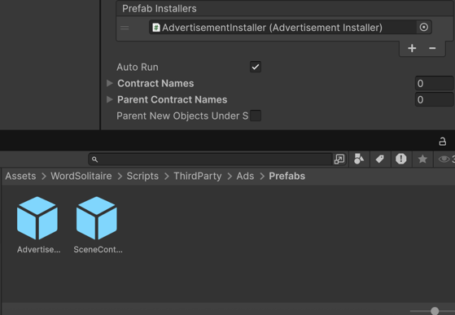
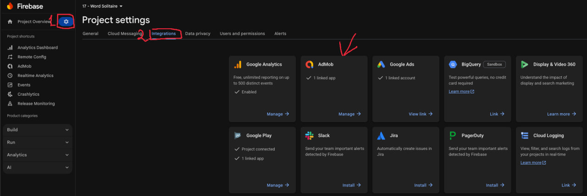

# Raccoons.AdsSample

This project demonstrates how to use AdMob Mediation in Unity, including integration with Firebase.

## Mediation Used
- Google AdMob
- Unity Ads

---

## Installation and Setup

### 1. Install Google Mobile Ads SDK
Download and import the latest AdMob Unity SDK:

https://github.com/googleads/googleads-mobile-unity/releases/tag/v10.6.0

---

### 2. Install Required Mediation Packages
Download and import all required mediation adapters:

https://developers.google.com/admob/unity/choose-networks#unity-package

---

### 3. Resolve Android Dependencies
In Unity, navigate to:

Assets → External Dependency Manager → Android Resolver → Force Resolve

sql
Копіювати код

The External Dependency Manager will resolve all dependencies from scratch and copy them into:

Assets/Plugins/Android

yaml
Копіювати код

---

### 4. Configure Google Mobile Ads
Open:

Assets → Google Mobile Ads → Settings

yaml
Копіювати код

Fill in App IDs for the required platforms (Android / iOS).

---

### 5. Configure AdMob Settings
Open **AdmobConfig** and fill all required fields for the target platforms.

Use the **IsDev** toggle to enable or disable test ads.

---

### 6. Add Installer to SceneContext
In your **SceneContext**, add the Ads prefab installer to the installers list.

If you do not have a SceneContext, import it into your boot scene.

Example:

---

### 7. Build and Verify
Build the project and check the console logs.

Make sure all ad services are initialized correctly and there are no errors related to Ad Services.

---

## Firebase Integration

Ensure that AdMob is connected to Firebase in the Firebase Console.

Example:

---

## Important Notes

- Do not invoke Unity API–related code in the same frame after an ad has been watched.  
  Always wait until the next frame to avoid Unity reinitialization issues.

- All reward-related buttons should be wrapped with analytics.

- Always initialize ad services at the start of the game, preferably in a boot scene or entry point.

- Make sure production builds are configured to use production advertisements, not test ads.